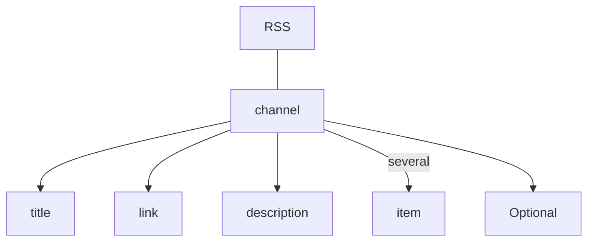
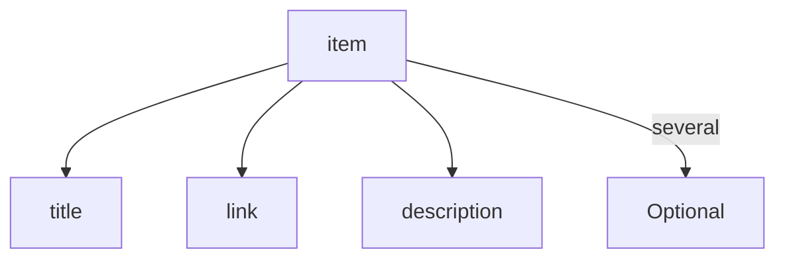

# RSS

[RSS原理、创建及使用——Denis Sureau](http://www.voidcn.com/article/p-rvrceoud-yw.html)

标准

1. ⭐Atom
2. RSS



Optional

```xml
<language></language>
<docs></docs>
<webMaster></webMaster>
<pubDate></pubDate>
```




Optional

```xml
<icon></icon>
<category></category>
<summary></summary>
<content></content>
<category></category>
<author>
    <name></name>
</author>
<published></published>
<updated></updated>
<id></id>
<pubDate></pubDate>
<guid></guid>
```


开源

[⭐Tiny Tiny RSS⭐](https://tt-rss.org/)

[Miniflux](https://miniflux.app/) [Sismics Reader](https://www.sismics.com/reader/)

[GCD](https://github.com/ming1016/GCDFetchFeed) [全民精进阅读](https://github.com/gitshan/rss-reader) [Only RSS Web](https://github.com/tonghs/OnlyRSSWeb)


- [Feed Validator](http://www.feedvalidator.org/). 输入你文件的URL来检查feed
- [Bioloide](https://www.scriptol.com/scripts/bioloide.php). PHP编写的在线RSS生成器和编辑器
- [RSS Reader](https://www.scriptol.com/rss/rss-reader.php). PHP函数用于在一个网页上显示本地或远程的RSS feed
- [fivefilters](http://fivefilters.org/content-only/)：可以将摘要RSS变成全文RSS
- [Huginn](https://github.com/cantino/huginn/wiki)：神器，不仅仅是制作RSS（任意网站、邮件等等）
- [feed43](http://feed43.com/)：可以为静态网站制作RSS
- [Reabble](http://reabble.com/)：通过该服务可以在kindle上阅读RSS
- [feedburner](https://feedburner.google.com/)：烧制RSS，可以用来托管自己制作的RSS
- [Instant RSS Search](Instant RSS Search)：RSS搜索引擎